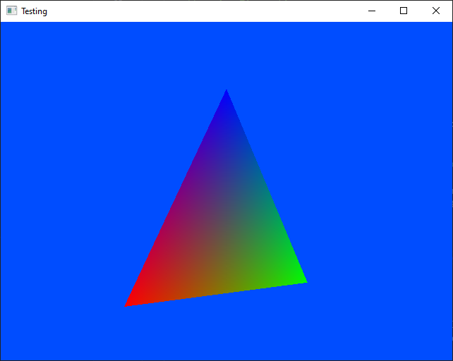

	

A simple OpenGL colored triangle based on examples of go-gl demo.

https://github.com/go-gl/example/blob/master/gl41core-cube/cube.go

It's been a while since I did OpenGL, honestly didn't expect that I would do that again in Go!
